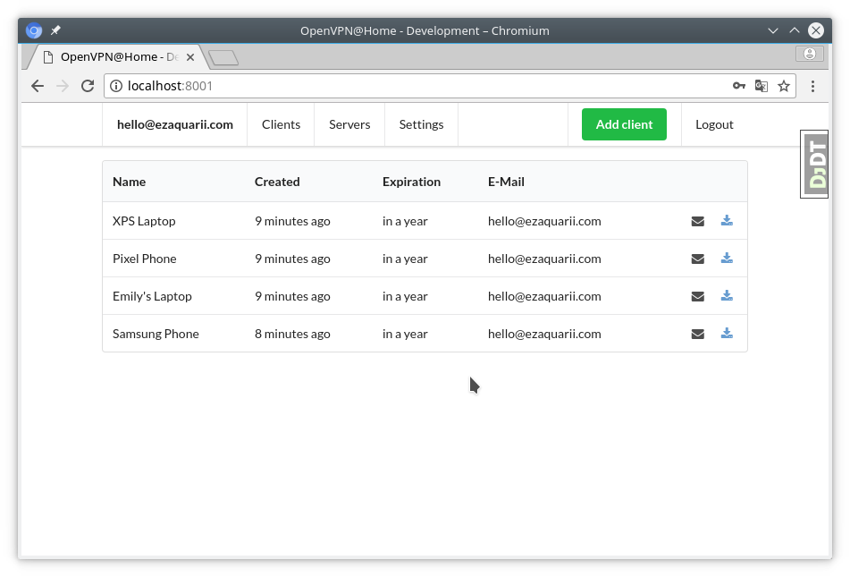

============
OpenVPN@Home
============

Legal mumbo-jumbo
=================

© 2002-2017 OpenVPN Inc.
OpenVPN is a registered trademark of OpenVPN  Inc.

This project is not endorsed by, sponsored or affiliated with OpenVPN Inc.

TL;DR
=====

OpenVPN PKI stuff with **React.js**, **Redux**, **Semantic UI** and **Django**.
And with love, of course.

Feedback and pull requests are welcome.

Brief
=====

Managing OpenVPN with PKI authentication is hard. Managing anything beyond hello-world using ``easy-rsa`` package
is a major issue - I could never maintain a config for more than a day. Other solutions are too *"enterprise"*
for a personal installation or were designed for a tin-foil hat, crypto maniacs hiding from NSA/GCHQ.

This app provides easy management console to keep OpenVPN configuration files in one place, provided in self-contained,
easily deployable, clickable package. It's not designed for security - it's meant just to be **good enough**.

And that works for me better than "no VPN at all".

Features:

#. users with admin/casual privilege separation
#. simple user registration
#. automatic generation of OpenVPN profiles
#. all crypto stuff is inlined into OpenVPN profiles
#. profiles can be sent by e-mail or downloaded as files

That's all folks. No fancy stuff. It's not a toolbox, it's a screwdriver to manage 3-5 home machines (and phones).

.. note:: This is a work-in-progress app, hacked together during x-mas break to solve a specific need of mine.
          Feel free to submit PRs with improvements.

Project structure
=================

The project is split into *backend* and *frontend*.

The backend is written in **Django** and **Django REST Framework**. The frontend is a **React.js** SPA application served by Django.
That division makes the build slightly more complicated, but provided *Makefiles* make it a breeze. It should just work.

Installation
============

Prerequisites
-------------

#. Working Node.js installation (tested with 9.2.1 & 9.3.0)
#. Python 3.5 with virtualenv
#. GNU Make (or compatible)
#. openvpn in ${PATH}
#. openssl in ${PATH}

Deployment
----------

After cloning the repository, you can deploy the app for development
with a single command:

::

    $ git clone https://github.com/ezaquarii/openvpnathome
    $ cd openvpnathome
    $ make devel
    ... frontend is bootstrapped ...
    ... backend is bootstrapped ...
    Enter admin user e-mail: <type your email>
    Enter admin user password [8 chars min]: <type password>
    ... DH params are generated ...
    $ make runserver

Open http://localhost:8001/ and you should be able to log-in.

Configuration
-------------

App config
~~~~~~~~~~

Configuration is managed in a standard Django way as a set of ``.py`` files. Settings are
kept in ``openvpnathome.settings`` package, but you should rather not fiddle with them... most of the time.

Private settings, like ``SECRET_KEY`` or email credentials are read from user-managed ``openvpnathome/config.py``
that is created during app bootstrapping process (or ``./manage configure`` or ``make configure``).

.. note:: ``config.py`` is excluded from Git repository, so you can safely put your real e-mail credentials there.

You can also access **Django Admin** app, which is left enabled.

OpenVPN config
~~~~~~~~~~~~~~

OpenVPN configuration is generated from templates in ``openvpnathome.apps.openvpn.templates``. If the default
configuration doesn't suit your needs, you can alter templates directly there.

There is no frontend config editor, although I was thinking about it.

Development
===========

Want to jump in? Fantastic. Quite frankly I hope that somebody will contribute, as I already solved my
problem and I have not much motivation left to solve problems I don't have, for myself.

I made it as easy to start development as possible. Top-level project directory contains 2 subprojects:
``backend`` and ``frontend``.

Top-level ``Makefile`` delegates targets to sub-projects and is provided only for convenience, to
quickly bootstrap the whole project with one command. You'll most likely use build scripts in each subproject
directly for most of the time.

I use *JetBrains WebStorm* and *PyCharm*, but you can use whatever you want. IDE files are not even in the repo.

Backend subproject
------------------

This is the **Django** app. Mostly REST API + single frontend serving view.
App modules have brief documentation inside ``__init__.py``. Docs are kept up-to-date, as I strongly
believe in code documentation.

Provided ``Makefile``'s default target displays help:

::

    $ make
    Welcome to OpenVPN@Home make system

    Available targets:
     * devel     - bootstrap project for development (your first choice)
     * install   - install virtual environment and all dependencies
     * distclean - clean project, delete all data (start from 'git clone' state)
     * runserver - start development server
     * test      - run full test suite

In development mode, frontend files are stored outside of this project, in ``frontend`` subproject. **Django** app
will pick static and templates from frontend build directory.

When development mode is off, frontend resources are taken from ``openvpnathome.apps.frontend`` app.

**Django Debug Toolbar** is provided by default, should you need to check which templates are picked up.

.. note:: Production mode is not very well tested, as I don't use it for now. I use this app served straight from
          ``manage.py runserver``. Production deployment would require **Nginx** to serve static files.
          Patches are welcome.

Frontend subproject
-------------------

Frontend sub-project contains **React.js** SPA served by **Django**.

Provided ``Makefile``'s default target displays help:

::

    $ make
    Welcome to OpenVPN@Home make system - frontend sub-project
    You need running node.js and yarn.

    Available targets:
     * start       - development build, output written to './dist', watching
     * build-prod  - build production build, update backend files
     * build-devel - development build, output written to './dist', but no watching
     * install     - install packages from package.json
     * distclean   - clean project, delete all data (start from 'git clone' state)

This is pretty self-explanatory too. When developing front-end code, you run **Django** app in development mode,
and ``make build-devel``. That runs ``webpack --watch``, re-loading app after each code change.

**Django** will pick frontend code from ``frontend/dist`` directory. You can see this in the web browser, as the
page title will say *OpenVPN@Home - Development* - clear indication that you're running a dev build.

If not sure - **Django Debug Toolbar** to the rescue.

**Django** injects some initial state via ```` tag. See ``index.html`` and ``openvpnathome.apps.frontent.views`` for
details.

Licence
=======

Quite frankly, I'm not sure. :)
GNU GPL v3 for now, but I might be convinced to change it if it scares off potential contributors.
Feel free to share your concerns via issue tracker.

Known issues
============

I left this as the last point, hoping not to scare anybody.

 * only one sever can be managed (I don't need more for now)
 * network errors are handled displaying alert() - happy path only, works for me 100%
 * frontend has 0% test coverage :o)
 * security is not a major concern for this app, I'm not running a CA company
 * no real user management - I rely on Django Admin panel for it
 * not tested on Windows, as I don't touch it even with a 10-foot stick, in rubber gloves - patches are welcome, however
 * no cert revocation

If you ask "why", the most probable answer is "**I** didn't need it".
