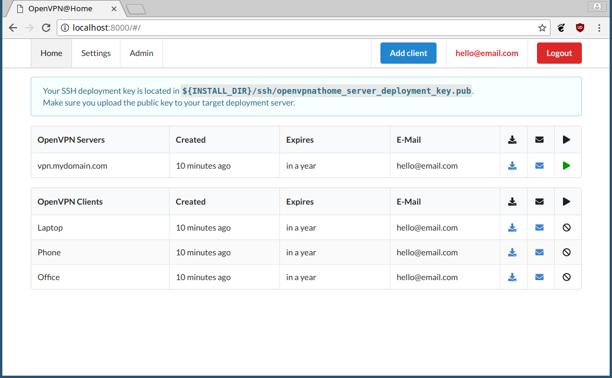
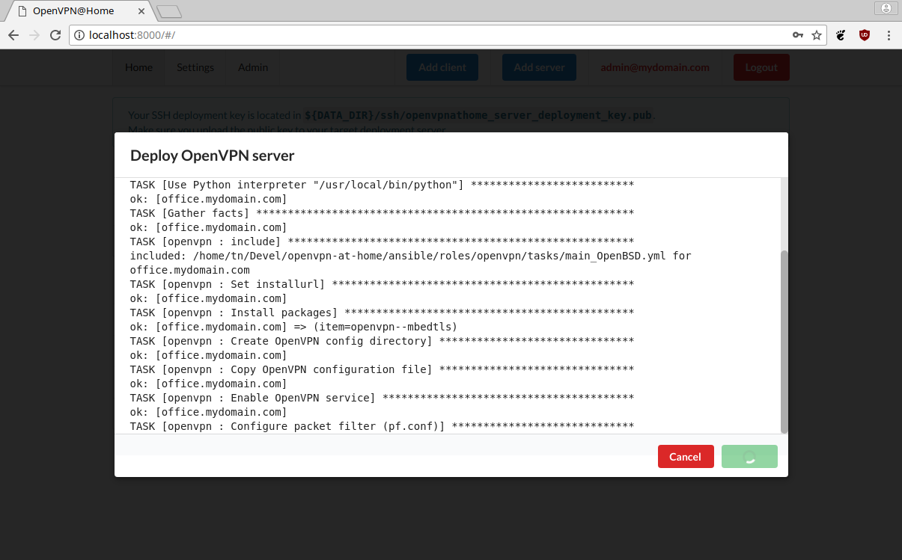
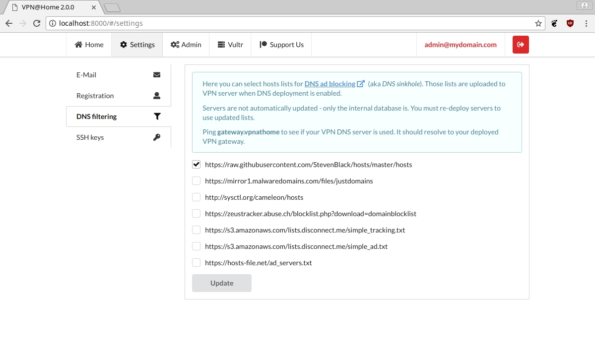

========
VPN@Home
========

.. raw:: html

    

        
        
        
        
        
    

    

        
    

TL;DR
=====

1-click deployment of OpenVPN with DNS ad blocking sinkhole. Deploys to your favorite VPS machine.
Created with **Vue.js**, **Semantic UI** and **Django**. And with love, of course.

Feedback and pull requests are welcome.

Legal mumbo-jumbo
=================

OpenVPN is a registered trademark of OpenVPN  Inc.
© 2002-2019 OpenVPN Inc.

This project is not endorsed by, sponsored or affiliated with OpenVPN Inc.

Brief
=====

Managing OpenVPN with PKI authentication is hard. Managing anything beyond hello-world using ``easy-rsa`` package
is a major issue - I could never maintain a config for more than a day. Other solutions are too *"enterprise"*
for a personal installation or were designed for a tin-foil hat, crypto maniacs hiding from NSA/GCHQ.

This app provides easy management console to keep OpenVPN configuration files in one place, provided in self-contained,
easily deployable, clickable package. It's not designed for security - it's meant just to be **good enough**.

And that works for me better than "no VPN at all".

Features:

#. 1-click deployment of OpenVPN server to your favorite VPS provider
#. DNS cache and ad blocking for VPN connected clients
#. OpenVPN clients management
#. generation of self-contained ovpn profiles for servers and clients
#. profiles can be sent by e-mail to owner or downloaded as files
#. tested on Ubuntu 18.04 and OpenBSD 6.4 (Vultr VPS)

That's all folks.

.. note:: This is a work-in-progress app, hacked together during x-mas break to solve a specific need of mine.
          Feel free to submit PRs with improvements.

FAQ
===

**Why?**

To quickly deploy VPN server when I need it. I can spin VPS and deploy my own VPN any time, tear it down
when not used and not paying a monthly fee for all my devices.

I travel a lot and I need to have on-demand VPN when browsing stuff in hotels, airports, etc.

**Does it hide my ass? Can I haz torrentz?**

No. Do not use it to do any stupid things.

**Is the app secure?**

Since the app manages OpenVPN server deployment, it must have root access to the VPN
machine. There is no separate deployment agent (yet), as it would over-complicate things.
It is not wise to keep it facing the open internet, I guess, so please don't do it.

**So how to host it?**

Preferably on your internal network. Keep the server bound to *localhost* and connect to it
via SSH tunnel. This way you don't need to configure SSL certificate and a lot of security
headaches go away.

I use it installed on my private laptop, the same way I use CUPS (printer stuff, aka localhost-colon-six-three-one).

**How to change server address after it is created?**

Use Django Admin panel to modify host field and re-deploy. All client configs must be re-deployed too.
You can try playing with DynDNS to work around it.

**Why Ansible? It's slow and weights 30MB.**

#. It does the job like a champ lifting tons of system complexity
#. Zero-effort deployment (no master nodes, etc)
#. Very easy to extend
#. I'd like to have more complex setup in the future and bash won't cut it

**Why not language X**?

I believe Python is optimal solution considering platform maturity, libraries quality and
skills proliferation. There is not much choice for the frontend.

Project structure
=================

The project is split into *backend*, *frontend*. and *ansible* scripts.

The backend is written in **Django** and **Django REST Framework**. The frontend is a **Vue.js** SPA application served by **Django**.
That division makes the build slightly more complicated, but provided *Makefiles* make it a breeze. It should just work.

**Ansible** is a set of scripts to deploy OpenVPN automatically either on localhost or remote machine.

Scripts located in **bin** are created either to automate and facilitate various tasks or provide a glue.
All scripts have internal documentation (or should have).

Installation
============

Prerequisites
-------------

#. Working Node.js installation (tested with 9.3.0)
#. Python 3 with virtualenv
#. GNU Make (or compatible)
#. Ansible (tested with 2.5.0, but no fancy functionality is used)
#. OpenVPN in ${PATH}
#. OpenSSL in ${PATH}
#. OpenSSH in ${PATH}
#. Internet connection (no off-line build possible)

Deployment
----------

For development
~~~~~~~~~~~~~~~

After cloning the repository, you can easily deploy the app for development:

::

    $ git clone https://github.com/ezaquarii/vpn-at-home
    $ cd vpnathome
    $ make install_build_deps  # apt-get only, other distros must do it manually
    $ make devel
    ... backend is bootstrapped ...
    ... frontend is bootstrapped ...
    $ make runserver

Open ``http://localhost:8001/`` and you should be able to log-in.

For development - Docker (unmaintained)
~~~~~~~~~~~~~~~~~~~~~~~~~~~~~~~~~~~~~~~

Works out of the box, no prerequisites besides docker needed

#. Clone the repo and go to the vpnathome directory.
#. Run ``docker-compose up``. Docker will `install and start a development server`_ for you.
#. Now you can go to ``http://localhost:8001/`` and you will be able to login.
#. Make some changes. The container will automatically pick them up `via a volume`_.
#. After you saved the changes, you can refresh ``http://localhost:8001/`` and will see them immediately.

.. _`install and start a development server`: DockerfileDev
.. _`via a volume`: docker-compose.yml#L11

For production - Docker (unmaintained)
~~~~~~~~~~~~~~~~~~~~~~~~~~~~~~~~~~~~~~

Docker container can be created with ``make``:

::

    $ make docker

Created image will be tagged with name ``vpnathome``.
You can launch a container with a helper script:

::

    $ ./bin/docker_run.sh bootstrap
    $ ./bin/docker_run.sh run

...or roll out your own fancy scripts for this. Data will be stored in a volume ``data``.

For production - Debian package
~~~~~~~~~~~~~~~~~~~~~~~~~~~~~~~

Package deployment is supported on *Ubuntu*. *Debian* should be supported, but I didn't test it there.

::

    $ make deb
    $ make install_deb

Open ``http://localhost:8000`` and follow on-boarding tutorial.

.. note:: Building ``deb`` package calls ``make distclean``, which will zap your development
          configuration. Build outside devel environment if you want to preserve your config.

The package needs virtually zero configuration:

- ``deb`` is self-deployable, as it contains entire virtualenv
- installs into ``/usr/lib/vpnathome`` (referred to as ``${ROOT}``)
- ``systemd`` service script ``vpnathome.service`` is installed and starts by default
- ``daphne`` runs on ``http://127.0.0.1:8000`` - bound to **localhost** only
- Contains bootstrapping script to automate app configuration (``${ROOT}/bin/init.sh``)

OpenVPN server deployment
~~~~~~~~~~~~~~~~~~~~~~~~~

Once the app is up and running, you can log in as admin (using credentials set during bootstrapping phase) and
create your server.

After a server is configured, you can deploy it using provided **Ansible** scripts. Beware that *Ansible* will modify
the target system!

#. required packages will be installed
#. firewall rules will be altered
#. IPv4 forwarding will be enabled

It is advised to deploy the server on a remote machine, but you can do it on localhost too. I personally test it
on Vultr VPS.

::

    $ ./bin/deploy_vpn.sh --help
    Usage:
    ./bin/deploy_vpn.sh [--help|--local|--host HOST]

    --help  - usage
    --local - deploy OpenVPN server on the current machine (localhost)
    --host  - deploy selected OpenVPN server only

If you deploy to a ``HOST``, it must be one of the defined VPN servers.

Configuration
-------------

If ``make devel`` was run, the app is up and running in development mode with default development
configuration:

- Admin login is *admin@locahost*
- Admin password is *admin1234*
- Database is located in ``${PROJECT_ROOT}/data/db/db.sqlite3``
- Settings have ``development`` flag set to true ``true``

To set new superuser, use ``./bin/manage set_admin <email> <pass>`` command.

App config
~~~~~~~~~~

Configuration is loaded from ``settings.json`` located in deployment directory. The settings file is generated
during a bootstrap stage, so there is no need to generate it manually. However, should you need to generate the
script during development, you can do it with a supplied Django management command:

::

    $ ${ROOT}/bin/manage configure [--accept] [--devel] [--help] [--force]

Once the file is generated (ie. after bootstrap), you must review and accept it by flipping the ``configured`` flag inside.

.. note:: ``settings.json`` is excluded from Git repository, so you can safely put your real e-mail credentials there
          during development.

You can also access **Django Admin** app, which is left enabled.

OpenVPN config
~~~~~~~~~~~~~~

OpenVPN configuration is generated from templates in ``vpnathome.apps.openvpn.templates``. If the default
configuration doesn't suit your needs, you can alter templates directly there.

There is no frontend config editor, although I was thinking about it.

Client connection
-----------------

Obtaining client config
~~~~~~~~~~~~~~~~~~~~~~~

VPN config files can be send to e-mail account of a user that created a config or downloaded.
Once downloaded, the config file (OVPN) can be used directly with OpenVPN client.

DNS check
~~~~~~~~~

If server was deployed with DNS cache enabled, DNS is forwarded to connecting client.
Depending on your network this might be slower or faster than popular DNS servers or DNS of your ISP.

To verify if your queries are forwarded to VPN DNS:

::

    ping gateway.vpnathome
    PING gateway.vpnathome (172.30.0.1) 56(84) bytes of data.
    64 bytes from _gateway (172.30.0.1): icmp_seq=1 ttl=255 time=46.5 ms
    64 bytes from _gateway (172.30.0.1): icmp_seq=2 ttl=255 time=48.7 ms

where ``172.30.0.1`` will be your choosen VPN gateway IP. Check ``systemd-resolve --status`` if DNS servers are
properly pushed.

Development
===========

Want to jump in? Fantastic.

I made it as easy to start development as possible. Top-level project directory contains 2 subprojects:
``backend`` and ``frontend``.

Top-level ``Makefile`` delegates targets to sub-projects and is provided for convenience. Once ``make devel`` is
done, you can work inside individual subproject with your favourite IDE.

I personally use *JetBrains WebStorm* and *PyCharm*, but you can use whatever you want.
IDE files are not even in the repo.

Backend subproject
------------------

This is the **Django** app. Mostly REST API + single frontend serving view.
App modules have brief documentation inside ``__init__.py``. Docs are kept up-to-date, as I strongly
believe in code documentation.

Provided ``Makefile``'s default target displays help:

::

    $ make
    Welcome to VPN@Home make system

    Available targets:
     * devel      - boostrap project for development (your first choice)
     * virtualenv - install virtual environment and all dependencies
     * runserver  - start development server
     * test       - run full test suite

In development mode, frontend files are stored outside of this project, in ``frontend`` subproject. **Django** app
will pick static and templates from frontend build directory.

When development mode is off, frontend resources are taken from ``vpnathome.apps.frontend`` app.

**Django Debug Toolbar** is provided by default, should you need to check which templates are picked up.

Frontend subproject
-------------------

Frontend sub-project contains **Vue.js** SPA served by **Django**. By default **Django** app will serve
stable, production version of the frontend app directly.

Provided ``Makefile``'s default target displays help:

::

    $ cd frontend
    $ make
    Welcome to VPN@Home make system - frontend sub-project
    You need running node.js and npm.

    Available targets:
     * build-prod  - build production build; backend project is NOT updated
     * build-devel - watch and make development build on change; output is written to './dist'
     * install     - install packages from package.json
     * distclean   - clean project, delete all data (start from 'git clone' state)

To start development of frontend code, you must first switch backend into development mode, by modifying ``data/settings.json``:

::

    {
        ...
        "configured": true,
        "development": true,
        "debug_toolbar_enabled": true,
        ...

Don't forget to restart the app. Once development mode is enabled, **Django** will load frontend from ``frontend/dist``
instead of ``vpnathome.apps.frontend``. You can verify this by inspecting site title - it should say
*VPN@Home <version> - development*. You can also use **Django Debug Toolbar** to troubleshoot the configuration.

**Django** injects some initial state via ```` tag. See ``index.html`` and ``vpnathome.apps.frontent.views`` for
details.

Licence
=======

GNU GPL v3.

Known issues
============

I left this as the last point, hoping not to scare anybody.

 * frontend has 0% test coverage :o)
 * security is not a major concern for this app, I'm not running a CA company
 * no real user management - I rely on Django Admin panel for it
 * not tested on Windows, as I don't touch it even with a 10-foot stick, in rubber gloves - patches are welcome, however
 * no cert revocation (yet)
